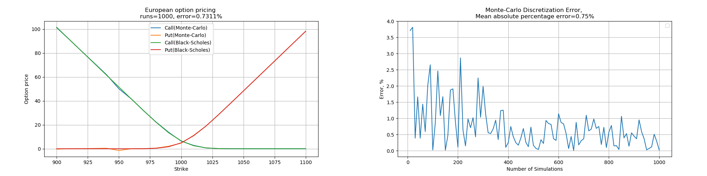
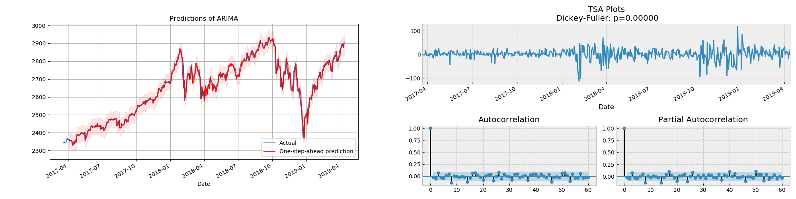
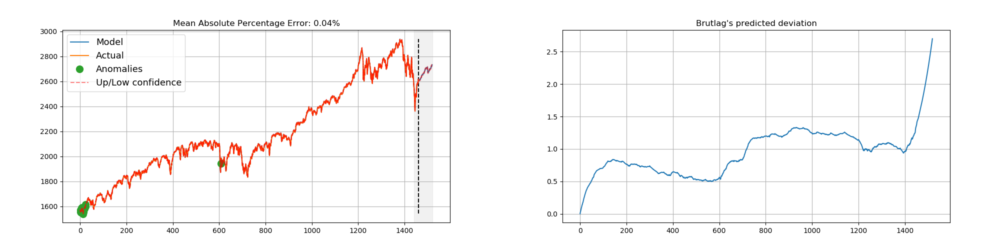
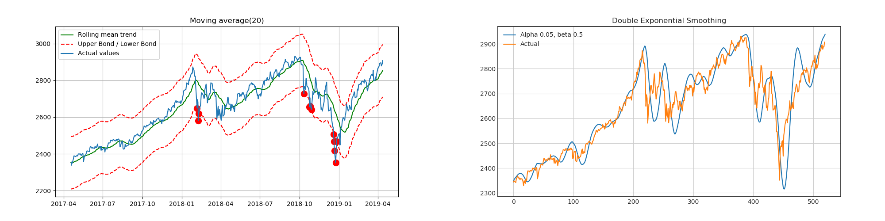

# Quantitative finance models and algorithms

[v0.3](CHANGELOG.md)

Collection of models with optimization algorithms for Time series analysis, algorithmic forecasting, quantitative research and risk-management.

### Assets pricing and Optimization models

[European Option Pricing](tutorials/Option-pricing.ipynb)
- European option pricing via Monte-Carlo simulation, Black-Scholes model
- discretization error estimate
- sensitivity analysis of option price to strike and volatility
- sensitivity of discretization error to number of simulations

[Linear Asset Pricing](tutorials/Linear-asset-pricing.ipynb)
- linear asset pricing: FX income, capital budgeting, floating-rate notes
- univariate concave nonlinear optimization of IRR-YTM using Brent method and binary grid search on subintervals
- available as mixed integer programming problem, ready-to-use on [NISQ](https://arxiv.org/abs/1801.00862) devices

### Time series analysis models
[GJR-GARCH](tutorials/GJR-GARCH.ipynb)
- Glosten-Jagannathan-Runkle GARCH(p, o, q)
- unsupervised optimization of parameters
- captures asymmetric shocks (leverage effect)

[Seasonal ARIMA](tutorials/Seasonal-ARIMA.ipynb)

- ARIMA(p, d, q)x(P, D, Q, s)
- unsupervised optimization of AR, MA and Seasonal parameters
- provides one-step-ahead predictions and out-of-sample forecast

[Holt-Winters model](tutorials/Holt-Winters.ipynb)  

- triple exponential smoothing
- cross-validation via Conjugate gradient, TNC
- in-sample prediction and extrapolation

[Smoothing methods](tutorials/Smoothing-Methods.ipynb)

- Moving average
- Exponential smoothing
- Double exponential smoothing

## License and Copyright
Copyright (c) 2019 Oleksii Lialka

Licensed under the [MIT License](LICENSE.md).
